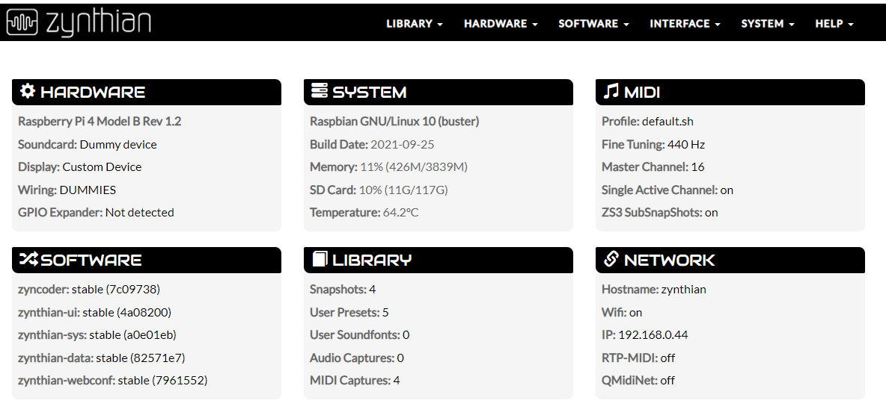
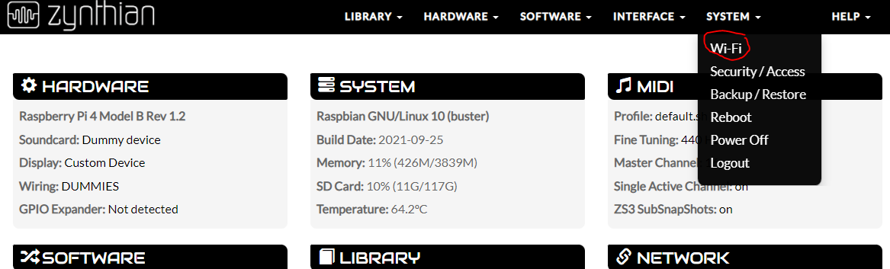
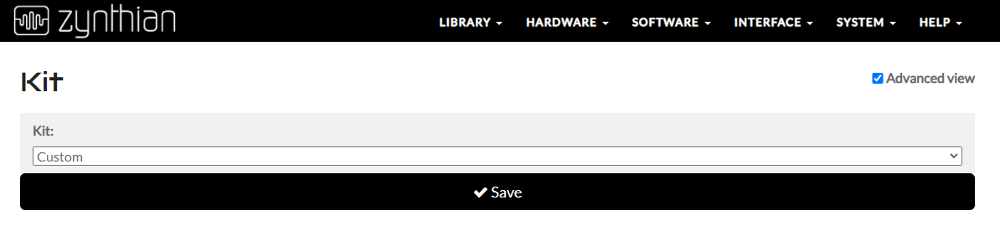
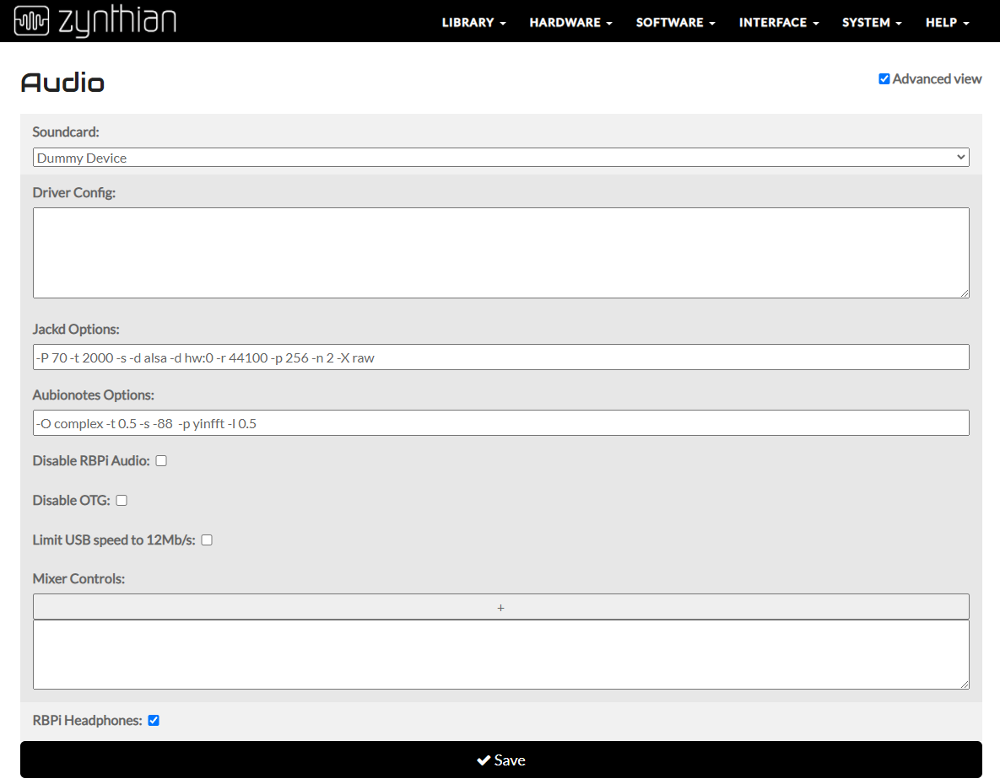
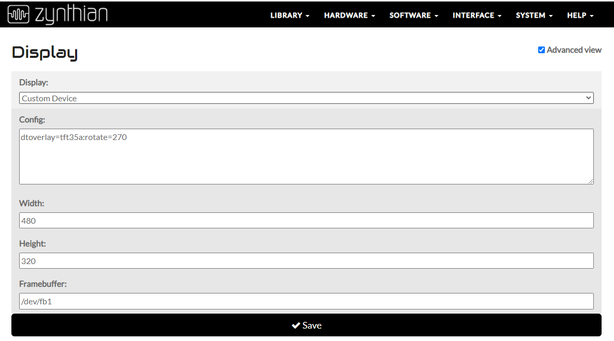

# Raspberry Pi 4B Zynthian install notes

A documented account of installing Zynthian Synthesizer onto a Raspberry PI with 3.5 Inch Touch Screen LCD display. 

&nbsp;


## Description

This is a high level documented account of installing and configuring Zynthian onto a to Raspberry Pi 4B (Model B) Rev 1.2 with a 3.5 LCD Touch screen display for reference purposes.


This is not a replacement for the official Zythian installation documentation 

The reader should have a working understanding of Linux/Mac command line if you intend to replicate the process.

Anyone using this as a reference for installing on same/similar hardware, you should reference the official documentation in the first instance which can be found [here](https://wiki.zynthian.org/index.php/Zynthian_Wiki_Home)


&nbsp; &nbsp;


## Scope
&nbsp; &nbsp;

* [Introduction](#introduction)
* [Hardware](#hardware)
* [Software](#software)
* [Installation Media](#installation-media)
* [Console connection](#console-connection)
* [Security Note](#security-note)
* [Overlay Deployment](#overlay-deployment)
* [Web Config](#web-config)
* [LCD Screen Calibration](#lcd-screen-calibration)
* [Midi and USB Keyboard](#midi-and-usb-keyboard)
* [Using Zynthian](#using-zynthian)
* [Debugging Tools](#debugging-tools)

&nbsp; &nbsp; &nbsp; &nbsp;


## Introduction
&nbsp; &nbsp;

From the Zynthian Wiki:

> "Zynthian is an Open Synth Platform: An Open Hardware device (currently based on Raspberry Pi) running ZynthianOS, a customized Linux distribution (currently Raspbian-based), specifically configured and adapted for audio synthesis & processing. ZynthianOS runs the physical UI (display + rotary encoders + switches), that allows you to create up to 16 sound layers (synthesis+processing audio chains) using a large collection of synthesis engines and audio-processing plugins, most of them Free Software along with some commercial ones. A freshly backed step sequencer is also available."  
End quote:
>

&nbsp;

Building Zynthian is not particularly difficult, however it does require very specific configuration in accordance with your selected hardware.

Although the official Raspberry Pi hardware is standardized, addition of a Touch Screen display may introduce some additional complexities.

Zynthian developers are aware of the challenges different hardware combinations introduce and have built functionality into the Zynthian Project to cater for specific combinations once they have been tested.

It's also worth noting the Zynthian community is very active and provides fantastic support for people wanting to try the Zynthian software.

In addition to the hardware combination challenges, there are also some potential humps to overcome to get the install initially accessible, this document includes some examples of how to work through these challenges.  

&nbsp; &nbsp;


## Hardware
&nbsp; &nbsp;
Hardware and Software used for the custom installation is as follows:

* Pi:Raspberry Pi 4 Model B Rev 1.2
* Soundcard: Onboard soundcard/Headphones - bcm2835
* Case: Owootecc Raspberry Pi 4 TFT 3.5 inch Touch Screen with Case
* Touchscreen Driver: ADS7846 Touchscreen
* Display: ili9486 (as reported by dmesg)
* Keyboard: Keystation 32
* Midi Interface: USB MidiMan Midisport 2x2
* SD Card: SanDisk Extreme Pro 128GB microSDXC Memory Card   NOTE: (It has been mentioned large SD cards can be problematic for Zynthian)

NOTE: These reference notes do not cover physical installation of the Raspberry Pi case or LCD screen, refer to manufacturers instructions for this step.  

&nbsp; &nbsp;


## Source / Software  
&nbsp; &nbsp;

* Zynthian Image: 2021-09-25-zynthianos-stable.img obtained from Zynthian Wiki latest stable version available [here](https://os.zynthian.org/zynthianos-last-stable.zip)  

* 3.5 LCD Screen Driver Repo [here](https://github.com/goodtft/LCD-show.git)  #NOTE: We only use this for the overlay files.

*  apt-get install xinput-calibrator  (additional package for calibration of LCD screen)  

&nbsp; &nbsp;


## Installation Media  
&nbsp; &nbsp;
Zynthian official documentation suggests use of Balena's 'Etcher'.  

There are a number of reports on Etcher corrupting SD cards which was my direct experience on 2 new SD cards, therefore I've taken an alternative approach to deploy the image to SD Card.  
&nbsp; &nbsp;


* Method 1:  
Use the Raspberry PI image tool which you can read about and obtain via this [link](https://www.raspberrypi.com/news/raspberry-pi-imager-imaging-utility/)  

Once installed, use the tool to deploy the latest stable image available [here](https://os.zynthian.org/zynthianos-last-stable.zip)  


* Method 2: (Note: Specific to Mac OS, DO NOT use this unless you are 100% comfortable and confident with the commands used otherwise you could wipe your entire operating system or another drive)  
Use native command line tools to wipe the SD card and copy the image.  See example below for Mac O/S.  


1. Insert the SD card into your machine.   


2. Confirm the device name:
NOTE: Ensure you use the SD removable disk and NOT any other disk. 

```
diskutil list

```

Which will produce something similar to this on a Macbook.  

```
mymac:downloads me$ diskutil list
/dev/disk0 (internal):
   #:                       TYPE NAME                    SIZE       IDENTIFIER
   0:      GUID_partition_scheme                         251.0 GB   disk0
   1:                        EFI EFI                     314.6 MB   disk0s1
   2:                 Apple_APFS Container disk1         250.7 GB   disk0s2

/dev/disk1 (synthesized):
   #:                       TYPE NAME                    SIZE       IDENTIFIER
   0:      APFS Container Scheme -                      +250.7 GB   disk1
                                 Physical Store disk0s2
   1:                APFS Volume Macintosh HD            216.5 GB   disk1s1
   2:                APFS Volume Preboot                 46.7 MB    disk1s2
   3:                APFS Volume Recovery                510.5 MB   disk1s3
   4:                APFS Volume VM                      25.8 GB    disk1s4

/dev/disk2 (external, physical):
   #:                       TYPE NAME                    SIZE       IDENTIFIER
   0:     FDisk_partition_scheme                        *31.9 GB    disk2
   1:             Windows_FAT_32 boot                    268.4 MB   disk2s1
   2:                      Linux                         31.6 GB    disk2s2

```


IMPORTANT: 
Take note of the 'external' device, in the above example it is /dev/disk2.  


3. Prepare the SD card to receive the Zynthian Image.  


Based on the above example I will use diskutil to format my removable USB drive mapped as '/dev/disk2'  


```
diskutil eraseDisk ExFAT Zynthian /dev/disk2
```


4. Unmount the disk in order to write the new filesystem.

```
diskutil unmountDisk /dev/disk2
```


5. Then we write the unzipped image to the raw device. 
NOTE: We have changed from using /dev/disk2 to /dev/rdisk2
```

dd if=<replace this with dir containing image>/2021-09-25-zynthianos-stable.img of=/dev/rdisk2 bs=4m
```


6. Eject the device from your machine, Insert the card into your raspberry Pi.

&nbsp; &nbsp;


## Console Connection

Initially when I attempted to setup the Pi I had a Monitor connected via HDMI and a keyboard and mouse, however I expected continuously flashing screen which made it difficult to naviate the menus or issue commands, I therefore opted to perform the initial configuration remotely via ssh and Zynthian Webconfig using the following process.

The Zynthian [Wiki](https://wiki.zynthian.org/index.php/Accessing_Zynthian_from_your_computer) also has good documentation for obtaining access, details below are specific to my setup and experience before actually reading the guidance from the Zynthian team.


1. Identifying the IP address of the machine. 
In order to to ssh to the Zynthian box, you will need the IP address.   After experiencing the flashing screen issues I opted to use a physical ethernet connection to allow the instance to pick up an IP address over DHCP and administer remotely.  


If you are able to obtain a stable console via monitor, keyboard and mouse, you can issue the 'ifconfig' command to determine the IP address of eth0.

To determine the newly assigned DHCP IP address you should be able to either.  

1. Log into your routers Web interface and review the attached devices.


2. Run nmap to sweep your local network and report on all visible devices assigned an address on your local network range. 


More info on Nmap can be found [here](https://nmap.org/download) 


The command syntax I used to scan my local network is below.  

```
#nmap -sn 192.168.0.0/24  
```


Once you have determined the IP address of your new instance you should be able to browse directly to the Zynthian Web IP via the IP address and be presented with a screen similar to the following.  


  

From this page Select System -> Wifi and configure for your local Wifi network using the 'Add Network' button and configure with the relevant SSID and Password.

  


Once the Wifi details have been correctly added, Save and reboot.  

You can use the same steps detailed above (i.e: nmap/router) to determine the newly assigned Wifi IP address.  


All going well, by this stage you should be able to browse to the Wifi IP address without the need for any physical network connection or screen and Monitor.  

&nbsp; &nbsp;


## Security Note
This would be a good time to change the default root password to something more secure.  Make sure you have a method of accessing this password, if you lose / forget this password, regaining access may be challenging.

You can refer to the official Zynthian documentation for more details on password management.


&nbsp; &nbsp;


## Overlay Deployment


Before we progress with configuration via the web UI, the LCD overlay files need to be deployed from the LCD driver repo.  

1. Connect to the Zynthian instance via ssh.  

2. Obtain the source using the following commands:

```
Run:
sudo rm -rf LCD-show
git clone https://github.com/goodtft/LCD-show.git
chmod -R 755 LCD-show
cd LCD-show/
sudo ./LCD35-show
```

Change into the LCD-show dir and copy the overlay files to the appropriate local folder.

```
cp ./usr/tft35a-overlay.dtb /boot/overlays/
cp ./usr/tft35a-overlay.dtb /boot/overlays/tft35a.dtbo
```


This is all we need from the LCD-show folder.  


&nbsp; &nbsp;


## Web Config

Via the Web UI we will now make changes to the following under Hardware:  

Kit
Audio
Display
Wiring


KIT.
#Change this to Custom  
  


AUDIO.
#Change this to 'Dummy Device' with the following settings and ensure 'RBPI Headphones' is selected (IMPORTANT)  

&nbsp; &nbsp;

  


DISPLAY.
#Change to 'Custom Device' with the following settings.  

&nbsp; &nbsp;


  


&nbsp; &nbsp;

Once you have updated the settings the system will need to reboot for the changes to fully take effect.

At this stage the LCD screen should now be working, however if using the same/similar hardware as me, you will need to calabirate the screen.  


&nbsp; &nbsp;


## LCD Screen Calibration

Install xinput-calibrator  

```
apt-get install xinput-calibrator

```

Export your DISPLAY to the console.
```
export DISPLAY=:0.0
```

Run xinput_calibrator which should open the LCD calibration tool on your LCD screen.  Follow the on screen instructions and then copy the output returned to your original remote session window.  

```
xinput_calibrator
```


The following configuration was output:  

```
Section "InputClass"
        Identifier      "calibration"
        MatchProduct    "ADS7846 Touchscreen"
        Option  "MinX"  "61530"
        Option  "MaxX"  "2367"
        Option  "MinY"  "61900"
        Option  "MaxY"  "3328"
        Option  "SwapXY"        "0" # unless it was already set to 1
        Option  "InvertX"       "0"  # unless it was already set
        Option  "InvertY"       "0"  # unless it was already set
EndSection

```

Due to the screen being rotated, the Axes were mis-aligned.  To resolve this I added the additional line to the configuration.

```
        Option "TransformationMatrix" "0 1 0 -1 0 1 0 0 1"

```

The final configuration was as follows:

```
Section "InputClass"
        Identifier      "calibration"
        MatchProduct    "ADS7846 Touchscreen"
        Option  "MinX"  "61530"
        Option  "MaxX"  "2367"
        Option  "MinY"  "61900"
        Option  "MaxY"  "3328"
        Option  "SwapXY"        "0" # unless it was already set to 1
        Option  "InvertX"       "0"  # unless it was already set
        Option  "InvertY"       "0"  # unless it was already set
        Option "TransformationMatrix" "0 1 0 -1 0 1 0 0 1"
EndSection

```


Which was then written as the complete contents of /etc/X11/xorg.conf.d/99-calibration.conf  


&nbsp; &nbsp;


## Midi and USB Keyboard  


The following was added to  /etc/udev/rules.d/99-midisport-firmware.rules to enable support for my Midisport Midi Interface and Keystation 32 USB Keyboard.  

```

\# midisport-firmware.rules - udev rules for loading firmware into MidiSport devices

\# MidiSport 1x1  
ACTION=="add", SUBSYSTEM=="usb*", ATTRS{idVendor}=="0763", ATTRS{idProduct}=="1010", RUN+="/sbin/fxload -s /usr/share/usb/maudio/MidiSportLoader.ihx -I /usr/share/usb/maudio/MidiSport1x1.ihx -D %N"

\# MidiSport 2x2  
ACTION=="add", SUBSYSTEM=="usb*", ATTRS{idVendor}=="0763", ATTRS{idProduct}=="1001", RUN+="/sbin/fxload -s /usr/share/usb/maudio/MidiSportLoader.ihx -I /usr/share/usb/maudio/MidiSport2x2.ihx -D %N"

\# KeyStation  
ACTION=="add", SUBSYSTEM=="usb*", ATTRS{idVendor}=="0763", ATTRS{idProduct}=="1014", RUN+="/sbin/fxload -s /usr/share/usb/maudio/MidiSportLoader.ihx -I /usr/share/usb/maudio/MidiSportKS.ihx -D %N"

\# MidiSport 4x4  
ACTION=="add", SUBSYSTEM=="usb*", ATTRS{idVendor}=="0763", ATTRS{idProduct}=="1020", RUN+="/sbin/fxload -s /usr/share/usb/maudio/MidiSportLoader.ihx -I /usr/share/usb/maudio/MidiSport4x4.ihx -D %N"

\# MidiSport 8x8  
ACTION=="add", SUBSYSTEM=="usb*", ATTRS{idVendor}=="0763", ATTRS{idProduct}=="1031", ATTRS{bcdDevice}=="0110", RUN+="/sbin/fxload -s /usr/share/usb/maudio/MidiSportLoader.ihx -I /usr/share/usb/maudio/MidiSport8x8-2.10.ihx -D %N"
ACTION=="add", SUBSYSTEM=="usb*", ATTRS{idVendor}=="0763", ATTRS{idProduct}=="1031", ATTRS{bcdDevice}=="0121", RUN+="/sbin/fxload -s /usr/share/usb/maudio/MidiSportLoader.ihx -I /usr/share/usb/maudio/MidiSport8x8-2.21.ihx -D %N"  

\# vim: ft=conf


```

## Using Zynthian  

If following these notes for reference to support your installation and setup, at this stage Zynthian should be ready to use once hooked up to your audio output / headphones.  

For instructions on using Zynthian a good place to start is [here](https://wiki.zynthian.org/index.php/Zynthian_UI_Users_Guide).

Zynthian is an amazing project as are the community who provide fantastic advice and support in addition to sharing their art and ideas.


&nbsp; &nbsp;


##  Debugging Tools


VIDEO:  
See below some additional commands which may provide support in debugging your installation and config.


List input devices:
```
export DISPLAY=:0.0

xinput list


⎡ Virtual core pointer                          id=2    [master pointer  (3)]
⎜   ↳ Virtual core XTEST pointer                id=4    [slave  pointer  (2)]
⎜   ↳ ADS7846 Touchscreen                       id=6    [slave  pointer  (2)]
⎣ Virtual core keyboard                         id=3    [master keyboard (2)]
    ↳ Virtual core XTEST keyboard               id=5    [slave  keyboard (3)]

```


List configurable settings for a specific input device.  


```
 xinput list-props 6
Device 'ADS7846 Touchscreen':
        Device Enabled (113):   1
        Coordinate Transformation Matrix (114): 0.000000, 1.000000, 0.000000, -1.000000, 0.000000, 1.000000, 0.000000, 0.000000, 1.000000
        libinput Calibration Matrix (245):      1.000000, 0.000000, 0.000000, 0.000000, 1.000000, 0.000000, 0.000000, 0.000000, 1.000000
        libinput Calibration Matrix Default (246):      1.000000, 0.000000, 0.000000, 0.000000, 1.000000, 0.000000, 0.000000, 0.000000, 1.000000
        libinput Send Events Modes Available (247):     1, 0
        libinput Send Events Mode Enabled (248):        0, 0
        libinput Send Events Mode Enabled Default (249):        0, 0
        Device Node (250):      "/dev/input/event0"
        Device Product ID (251):        0, 0

```

Update configuration directly without need to reboot (this is for testing and not permenant)


```
xinput set-prop 6 “libinput Calibration Matrix” 0 1 0 -1 0 1 0 0 1

```


AUDIO  

List playback devices
```
aplay -l

```

Test audio device outside of Zynthian

```
speaker-test -c2 -D plughw:2,0

aplay --device=hw:2,0 piano2.wav    (you need to have a wav file for this to work.)

```


&nbsp; &nbsp;


## Acknowledgments  

* [Zynthian Project](https://zynthian.org/) 
* The Zynthian core developers and community, especially  le51, riban, wyleu, ronsum, jofemodo.  Who provided amazing support and encouragement throughout.
* See the threads detailing my initial issues install [here](https://discourse.zynthian.org/t/new-build-black-screen/6818) and [here](https://discourse.zynthian.org/t/low-barely-audible-sound-from-3-5mm-headphone/6830)
* Testing sound on a Raspberry Pi site [here](https://www.tinkerboy.xyz/raspberry-pi-test-sound-output/)
* A good thread regarding LCD calibration [here](https://raspberrypi.stackexchange.com/questions/60872/inverted-gpio-touchscreen-using-99-calibration-conf)


